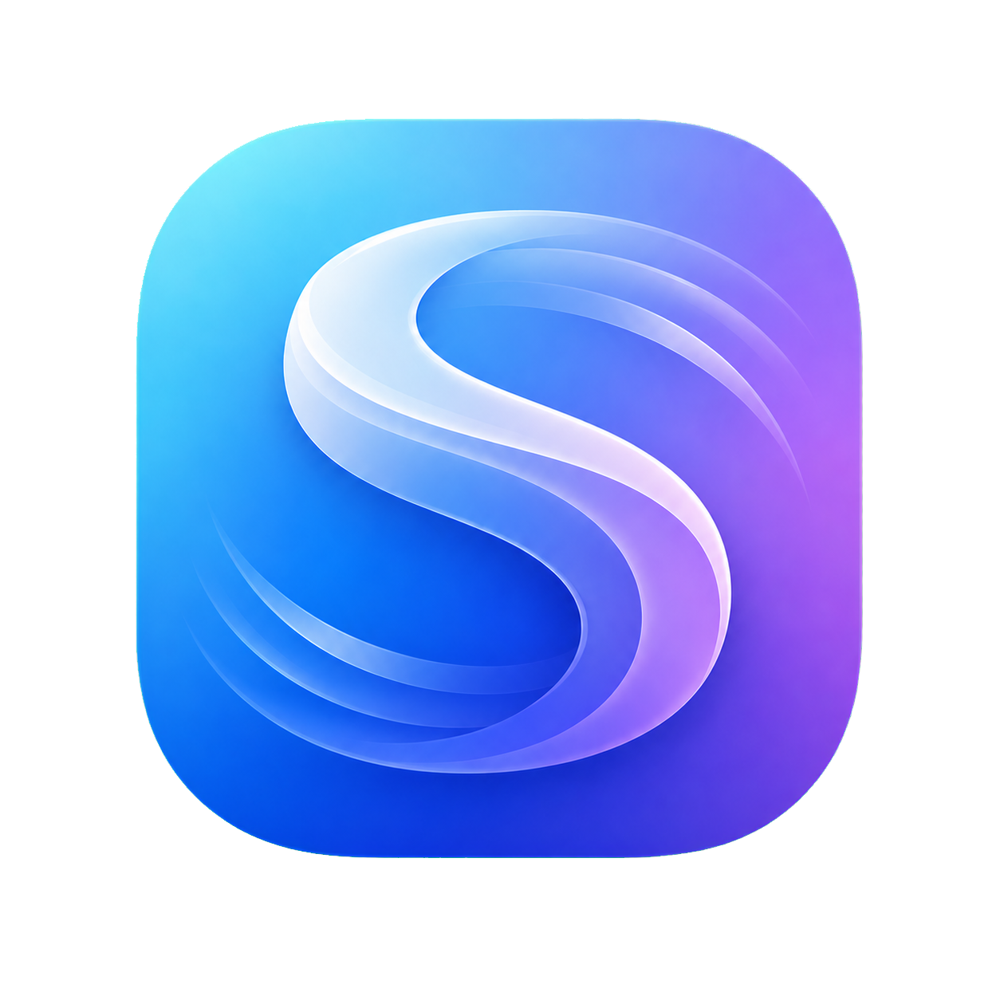
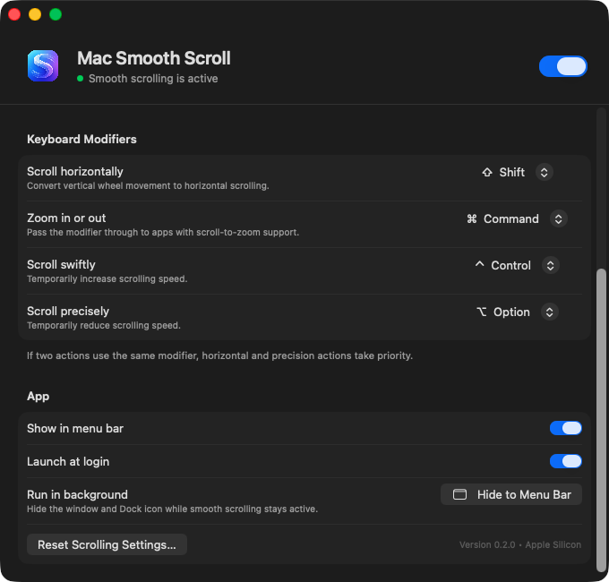

<p align="center">
  
</p>

# Mac Smooth Scroll

[](https://github.com/ronnelb-dev/mac-smooth-scroll/actions/workflows/ci.yml)

Mac Smooth Scroll is a native Apple Silicon macOS utility that turns discrete
external mouse-wheel input into smooth pixel scrolling while leaving native
trackpad and Magic Mouse events untouched.



## Features

- Low, medium, and high smoothness presets
- Slow, medium, and fast speed presets
- Configurable minimum wheel-step distance
- Responsive, balanced, and glide feel presets
- Display-synchronized motion on 60 Hz and high-refresh-rate screens
- Optional trackpad-like gesture phases
- External-mouse-only reverse direction
- Adaptive first-notch precision with cadence-based acceleration
- Immediate braking on direction changes and bounded maximum velocity
- Dominant-axis locking that filters diagonal wheel noise
- Configurable horizontal, zoom, swift, and precision modifier keys
- Menu-bar control
- Hide-to-menu-bar mode that removes the settings window and Dock icon
- Background-only launch at login with a dedicated helper
- Native Accessibility permission onboarding
- Automatic pause while Mac Mouse Fix is running to prevent conflicting input
- Persistent System Health checks with guided recovery and privacy-safe diagnostics

## Requirements

- Apple Silicon Mac
- macOS 13 or later
- Accessibility permission

## Installation

When a DMG is available from a trusted build or release:

1. Open `Mac-Smooth-Scroll-<version>-arm64.dmg`.
2. Drag **Mac Smooth Scroll** onto the **Applications** shortcut.
3. Open Mac Smooth Scroll from `/Applications`.
4. Follow the Accessibility steps below.

Every successful Apple Silicon CI run uploads its versioned DMG for 14 days.
Open the workflow run on GitHub and download the `arm64-dmg` artifact.

The current DMG is not Developer ID signed or notarized, so it is a development
artifact rather than a public production download.

See the complete [installation and Accessibility guide](docs/INSTALLATION.md)
before installing the preview build.

### Build a local DMG installer

Building from source requires the Xcode command-line tools.

1. Install the Xcode command-line tools:

   ```sh
   xcode-select --install
   ```

2. Clone and build the installer:

   ```sh
   git clone https://github.com/ronnelb-dev/mac-smooth-scroll.git
   cd mac-smooth-scroll
   ./Scripts/build-dmg.sh
   ```

3. Open the versioned DMG in `dist/`, then drag the app onto **Applications**.

Confirm that the build machine is Apple Silicon with `uname -m`. The output
should be `arm64`.

The local app inside the DMG is ad-hoc signed unless
`MAC_SMOOTH_SCROLL_SIGNING_IDENTITY` is provided. It is intended for development
use and is not a substitute for Developer ID signing and Apple notarization.

## First launch and Accessibility

Mac Smooth Scroll uses a Core Graphics event tap to replace discrete external
mouse-wheel events with smooth pixel scrolling. macOS requires Accessibility
permission for this.

1. Open Mac Smooth Scroll.
2. Select **Request Permission**.
3. In **System Settings → Privacy & Security → Accessibility**, enable
   **Mac Smooth Scroll**.
4. Return to the app. Its status should change to
   **Smooth scrolling is active**.

Input Monitoring is not normally required by the app's permission check. If
Accessibility is already enabled but the app still reports that permission is
required, follow the [permission troubleshooting steps](docs/TROUBLESHOOTING.md#accessibility-is-enabled-but-the-app-still-asks-for-permission).

## Using the app

- Check **System Health** for live Accessibility, scroll-engine, mouse-driver,
  and login-helper status. When attention is required, use the recovery button
  shown on the affected row.
- Under **Scrolling**, choose **Feel**, **Speed**, and whether external-mouse
  scrolling should be reversed.
- Under **Advanced Scrolling**, use **Smoothness** to control how gradually
  wheel movement decays.
- Use **Step** to set the minimum distance generated by each discrete wheel
  input. Lower values favor precision; higher values move farther per notch.
- Enable **Adaptive precision** to make the first wheel step after idle precise,
  then ramp smoothly as the wheel is moved faster.
- Enable **Trackpad-like gestures** to add gesture phases used by natural
  scrolling and horizontal navigation.
- Assign modifier keys for horizontal scrolling, zoom, faster scrolling, and
  precision scrolling.

Trackpad and Magic Mouse events are passed through unchanged. The selected zoom
modifier is forwarded for the complete wheel burst only when no higher-priority
transform action is active. Zoom behavior still depends on whether the active
app supports modifier-scroll zooming.

## Menu-bar mode

Choose **Hide to Menu Bar**, close the settings window, or press `⌘H` to keep
smooth scrolling active without a Dock icon. Use **Open Mac Smooth Scroll…**
from the menu-bar item—or open the app again—to restore Settings.

Hiding the app automatically enables **Show in menu bar** so there is always a
way to reopen Settings or quit. The menu-bar item shows the live scroll-engine
status and provides:

- A checkmarked **Smooth Scrolling** toggle
- Quick, checkmarked **Feel** and **Speed** submenus
- A contextual recovery command when permission, Mac Mouse Fix, or the event
  tap blocks scrolling
- **Open Settings…** and **Quit Mac Smooth Scroll**

The menu-bar icon and its VoiceOver label also reflect whether scrolling is
active, intentionally off, or needs attention. Status is refreshed whenever
the menu opens.

## Launch at login

Install the app in `/Applications` before enabling **Launch at login**. The
embedded login helper starts the main app with `--background`, so scrolling
continues with no settings window or Dock icon.

The **Launch at login** row under **System Health** reports whether macOS
considers the helper enabled, disabled, missing, or waiting for approval.
App updates refresh the registered helper, and the helper retries transient
launch failures before asking macOS to relaunch it.

If macOS requests approval, open **System Settings → General → Login Items** and
allow Mac Smooth Scroll. Disable **Launch at login** inside the app before
moving or deleting the application.

## Privacy

Mac Smooth Scroll processes wheel events locally. The current source contains
no networking, analytics, telemetry, advertising, account, cloud-sync, or
automatic-update code. It does not save or transmit raw wheel events or
keyboard input.

Preferences are stored locally with macOS `UserDefaults`. The app checks only
whether Mac Mouse Fix is running, by bundle identifier, so it can pause and
avoid duplicate mouse processing. See the complete [privacy statement](docs/PRIVACY.md).

**Copy Diagnostics** copies app version, macOS version, architecture, and the
current System Health states. It does not include usernames, paths, mouse
activity, certificates, device identifiers, or wheel-event contents.

## Troubleshooting

See [Troubleshooting Mac Smooth Scroll](docs/TROUBLESHOOTING.md) for help with:

- Accessibility permission that is already enabled but not detected
- Smooth scrolling that does not start
- Conflicts with Mac Mouse Fix or another mouse utility
- A missing Dock or menu-bar icon
- Launch at Login approval
- Permission prompts after rebuilding the app

## Uninstall

1. Open Mac Smooth Scroll and disable **Launch at login**.
2. Choose **Quit Mac Smooth Scroll** from its menu-bar item.
3. Move `/Applications/Mac Smooth Scroll.app` to the Trash.
4. Remove Mac Smooth Scroll from
   **System Settings → Privacy & Security → Accessibility**.
5. Optionally remove saved preferences:

   ```sh
   defaults delete com.ronnel.mac-smooth-scroll
   ```

## Known limitations

- Apple Silicon and macOS 13 or later are required.
- There is no notarized public binary yet; users build the app from source.
- Settings are global; per-app and per-mouse profiles are not implemented.
- Other mouse drivers can duplicate or distort wheel input. Mac Mouse Fix is
  detected automatically, but other utilities may need to be quit manually.
- Ad-hoc rebuilds can require Accessibility permission to be approved again.

## Build and signing

The build script signs ad-hoc by default and never selects a certificate from
your Keychain automatically. To opt in to certificate signing, explicitly set
`MAC_SMOOTH_SCROLL_SIGNING_IDENTITY` to the identity you want to use:

```sh
MAC_SMOOTH_SCROLL_SIGNING_IDENTITY="Developer ID Application: Your Name (TEAMID)" \
    ./Scripts/build-app.sh
```

Certificate-signed builds use the hardened runtime and a secure timestamp.
Distribution to other Macs still requires an Apple Developer ID Application
certificate and notarization. Ad-hoc local rebuilds may require Accessibility
permission to be approved again.

## Tests

Run the XCTest suite on Apple Silicon with:

```sh
swift test --arch arm64
```

The tests cover launch-mode parsing, settings defaults and persistence,
modifier behavior, burst and axis rules, direction-change braking, velocity
limits, and refresh-rate-independent motion. GitHub Actions runs the suite
before packaging every pull request and `main` update.

## Development notes

The app uses an independent Swift implementation built with public macOS APIs:
SwiftUI/AppKit for settings and Core Graphics for wheel event capture and
synthetic pixel scrolling. It is not a renamed build of Mac Mouse Fix.

Mac Mouse Fix is an excellent independent project and was used as behavioral
inspiration. No Mac Mouse Fix source files are included in this repository.

Contributions are welcome. Read [CONTRIBUTING.md](CONTRIBUTING.md) before
opening a pull request. Report suspected vulnerabilities according to
[SECURITY.md](SECURITY.md), not through a public issue.

## License

Mac Smooth Scroll is licensed under the
[GNU General Public License v3.0](LICENSE).
